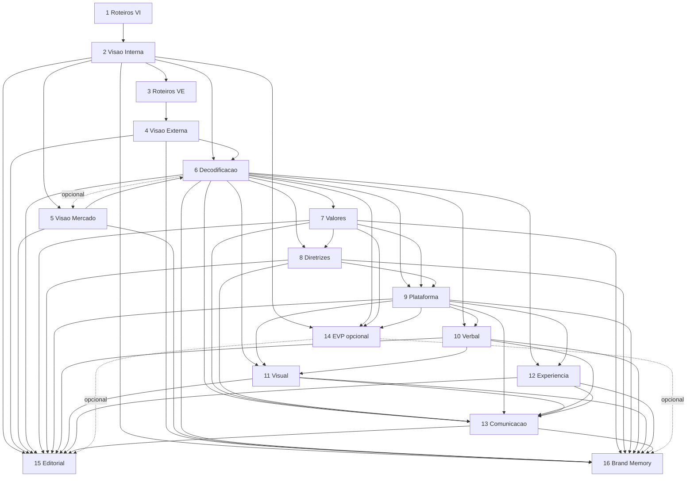
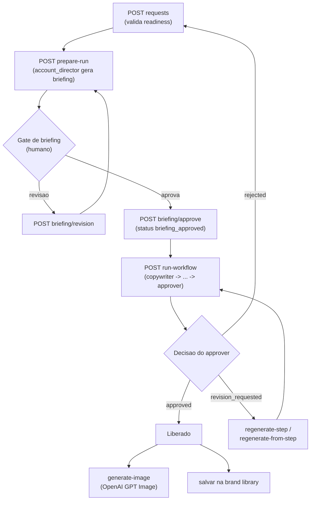

# Estrutura Atual e Fluxo de Agentes

Documento de referencia para evoluir o modelo ideal da Espansione.

Estado atual: a Fase 1 faz o mapeamento da marca, consolida os outputs dos
agentes e gera a Brand Memory. A Fase 2 usa essa Brand Memory como insumo
para operar uma agencia de marketing enxuta, com papeis especializados, gate
de aprovacao de briefing e gate final de aprovacao de marca.

Este doc esta sincronizado com o codigo real. Onde codigo e schema divergem,
o doc declara a divergencia em vez de esconder (ver "Estado do Schema").

## Visao Geral

```mermaid
flowchart LR
  subgraph F1["Fase 1 - Mapeamento da Marca"]
    A1["Agentes 1-5\nColeta e leitura VI/VE/VM"]
    A2["Agentes 6-9\nSintese estrategica e plataforma"]
    A3["Agentes 10-13\nIdentidade, experiencia e comunicacao"]
    A4["Agentes 14-15\nEVP opcional e editorial"]
    A5["Agente 16\nColetor Brand Memory"]
  end

  subgraph BM["Brand Memory"]
    B1["brands"]
    B2["diagnostic_runs"]
    B3["brand_snapshots"]
  end

  subgraph F2["Fase 2 - Agencia (dentro de diagnostic-web)"]
    R["agency_requests\n(pedido + readiness)"]
    BG["Gate de briefing\n(humano aprova)"]
    WF["Workflow sequencial\n7 agentes"]
    OUT["Outputs + signals\n+ learning + library"]
  end

  A1 --> A2 --> A3 --> A4 --> A5
  A5 --> BM
  BM --> R
  R --> BG
  BG --> WF
  WF --> OUT
  OUT -.->|gaps viram aprendizado| BM
```

A seta tracejada de `OUT` para `BM` e intencionalmente nao automatica:
signals e learning suggestions entram numa fila revisada por humano e nao
mutam a Brand Memory sozinhos.

## Camadas do Sistema

### Aplicacao Principal

- `web/apps/diagnostic-web`
- Contem o painel, formularios, APIs, execucao da esteira da Fase 1 e
  visualizacao dos outputs.
- Tambem hospeda **todo o runtime da Fase 2**: `lib/agency/*`,
  `pages/api/agency/*` e telas `pages/adm/[id]/agency*`.
- E o centro operacional das duas fases hoje.

### Tipos Compartilhados

- `web/packages/types`
- Define o contrato canonico `EspansioneDiagnostic` em
  `src/espansione-diagnostic.types.ts`.
- Define os contratos da Fase 2 em `src/agency.types.ts`: `AgencyRequest`,
  `AgencyRun`, `AgencyStep`, `AgencyOutput`, `BrandKernel`,
  `BrandReadinessResult`, `AgencyExecutionProfile`, `AgencyExecutionPlan`,
  `ApprovalDecision` e os enums (request type, channel, objective, status,
  agent id, etc.).
- Tambem: `output-quality.types`, `brand-memory-export-validation.types`,
  `curated-evidence.types`, `checkpoint.types`.

### Brand Memory

- `web/packages/brand-memory`
- Carrega e reconstroi a memoria ativa da marca a partir de snapshots.
- Funcoes:
  - `loadBrandMemory(supabase, diagnostic, options?)` - carrega um
    `EspansioneDiagnostic` na Brand Memory; idempotente; exige metadados de
    revisao humana (`reviewedBy`, `reviewedAt`, `agent16OutputId`).
  - `getBrandMemory(supabase, brandId)` - retorna o `EspansioneDiagnostic`
    ativo reconstruido.
  - `getBrandMemorySlice(supabase, brandId, agentId)` - retorna um snapshot
    (slice de um agente).
  - `getActiveBrandMemoryVersion(supabase, brandId)` - registro da versao
    ativa.

### Agencia (nucleo puro)

- `web/packages/agents`
- Nucleo puro da Fase 2. **Nao chama modelo diretamente** - apenas constroi
  kernel, briefs e prompt packs. A chamada de modelo acontece no runtime de
  `diagnostic-web` (`lib/agency/modelGateway.js`).
- Modulos:
  - `index.ts` - `buildBrandKernel`, `buildAgencyRun`,
    `buildAgencyRunFromBrandMemory`, `buildAgentBrief`,
    `buildApprovalChecklist`, `AGENCY_AGENT_SPECS` (7 agentes),
    `DEFAULT_AGENCY_AGENT_IDS`.
  - `brand-readiness.ts` - valida se a marca esta pronta para operar
    (`validateBrandReadinessForAgency`, `allowedRequestTypesForStatus`).
  - `prompt-packs.ts` - constroi system/user prompt + schema esperado por
    agente (`buildAccountDirectorPromptPack`, ... `buildApproverPromptPack`).
  - `execution-profiles.ts` - perfis de execucao e selecao automatica
    (`selectAgencyExecutionProfile`, `buildAgencyExecutionPlan`).
  - `model-registry.ts` - registro de modelos e resolucao por step
    (`resolveModelForAgencyStep`, `getDefaultAgencyModelSelection`).

### Worker

- `web/apps/agency-worker`
- Placeholder neutralizado (`console.log` inativo). A Fase 2 roda dentro de
  `diagnostic-web` por enquanto.
- Deve nascer apenas quando houver necessidade real de fila, agendamento,
  execucao longa ou tarefas fora da Vercel.
- `apps/agency-web` foi removido - nao existe app de agencia separado.

## Fase 1 - Esteira de Mapeamento da Marca

### Stages (ordem exata do codigo)

`lib/ai/pipeline.js` define `STAGES` nesta ordem:

1. `pre_diagnostico`
2. `diagnostico_interno`
3. `diagnostico_externo`
4. `sintese`
5. `estrategia`
6. `visual_verbal`
7. `cx`
8. `comunicacao`
9. `marca_empregadora`
10. `encerramento`

Catalogo dos agentes em `lib/agents/catalog.js`; slices de export em
`lib/brand-memory/exportValidation.js`.

### Agente 1 - Roteiros VI / Entrevistas Internas

- Stage: `pre_diagnostico`. Inputs: formularios.
- Funcao: preparar roteiros e leitura inicial para investigacao interna.
- Nao exporta para Brand Memory. Alimenta o Agente 2.

### Agente 2 - Consolidado da Visao Interna

- Stage: `diagnostico_interno`. Inputs: Agente 1, formularios internos,
  entrevistas, CIS e diagnostico 360.
- Exporta para Brand Memory: `vi`.
- Alimenta: Agentes 3, 5, 6, 14, 15 e 16.

### Agente 3 - Roteiros VE / Entrevistas Cliente

- Stage: `diagnostico_externo`. Inputs: Agente 2 e intake de clientes.
- Nao exporta para Brand Memory. Alimenta o Agente 4.

### Agente 4 - Consolidado da Visao Externa

- Stage: `diagnostico_externo`. Inputs: Agente 3, intake e entrevistas.
- Exporta para Brand Memory: `ve`.
- Alimenta: Agentes 6, 15 e 16.

### Agente 5 - Visao de Mercado

- Stage: `diagnostico_externo`. Inputs: Agente 2 (opcional Agente 6).
- Roda em split: `enrichContext` (deep research + Tavily Extract) antes da
  sintese principal. `preferredModel: claude-opus-4-7`.
- Exporta para Brand Memory: `vm` e `vm_sources`.
- Alimenta: Agentes 6, 15 e 16.

### Agente 6 - Decodificacao e Direcionamento Estrategico

- Stage: `sintese`. Checkpoint: **1**. Inputs: Agentes 2, 4 e 5.
- Roda single-call (sem `enrichContext`);
  `consumesContextInUserPrompt: true`.
- Exporta para Brand Memory: `decodificacao` (e, opcional,
  `strategic_tensions`, `executional_readiness`).
- Critico para a Fase 2. Alimenta: Agentes 7-16.

### Agente 7 - Valores e Atributos

- Stage: `estrategia`. Inputs: Agente 6.
- Exporta para Brand Memory: `values_and_attributes`.
- Alimenta: Agentes 8, 9, 13, 14, 15 e 16.

### Agente 8 - Diretrizes Estrategicas

- Stage: `estrategia`. Inputs: Agentes 6 e 7.
- Exporta para Brand Memory: `diretrizes_estrategicas` e
  `diretrizes_reinforcement_logic`.
- Alimenta: Agentes 9, 13, 15 e 16.

### Agente 9 - Plataforma de Branding

- Stage: `estrategia`. Checkpoint: **2**. Inputs: Agentes 6, 7 e 8.
- Exporta para Brand Memory: `plataforma_branding`.
- Critico para a Fase 2. Alimenta: Agentes 10-16.

### Agente 10 - Identidade Verbal

- Stage: `visual_verbal`. Inputs: Agentes 6 e 9.
- Exporta para Brand Memory: `voice_profile`.
- Alimenta: Agentes 11, 13, 15 e 16.

### Agente 11 - One Page de Personalidade (Visual)

- Stage: `visual_verbal`. Checkpoint: **3**. Inputs: Agentes 6, 9 e 10.
- Exporta para Brand Memory: `visual_identity`.
- Alimenta: Agentes 13, 15 e 16.

### Agente 12 - One Page de Experiencia

- Stage: `cx`. Inputs: Agentes 6 e 9.
- Exporta para Brand Memory: `experiencia`.
- Critico para a Fase 2. Alimenta: Agentes 13, 15 e 16.

### Agente 13 - Plano de Comunicacao - A Marca Fala

- Stage: `comunicacao`. Checkpoint: **4**. Inputs: Agentes 6, 7, 8, 9, 10,
  11 e 12.
- Exporta para Brand Memory: `plano_comunicacao`.
- Critico para a Fase 2. Alimenta: Agentes 15 e 16.

### Agente 14 - Plataforma de Marca Empregadora / EVP

- Stage: `marca_empregadora`. Modular/opcional. Inputs: Agentes 2, 6, 7 e 9.
- So roda se o projeto contratou escopo de EVP (`projetos.tem_evp`).
- Exporta para Brand Memory: `evp`. Sua ausencia nao bloqueia a Brand
  Memory. Alimenta: Agentes 15 e 16 quando rodado.

### Agente 15 - Consolidador Editorial do Entregavel Final

- Stage: `encerramento`. Inputs: Agentes 2, 4, 5, 6, 7, 8, 9, 10, 11, 12,
  13 e (opcional) 14.
- Gera carta de abertura, sumario executivo e consolidacao editorial.
- Nao exporta para Brand Memory. Nao e fonte canonica.

### Agente 16 - Coletor para Brand Memory

- Stage: `encerramento`. Modular (disparo manual). Inputs: Agentes 2, 4, 5,
  6, 7, 8, 9, 10, 11, 12, 13 e (opcional) 14.
- Funcao: coletar apenas as tags `<brand_memory_export>` dos agentes
  upstream, validar e consolidar no contrato `EspansioneDiagnostic`.
- Nao interpreta, nao infere, nao resolve divergencias.
- `preferredModel: claude-haiku-4-5-20251001` (extracao pura, baixo custo).
- Output canonico: `espansione_diagnostic`. Carregado na Brand Memory via
  `loadBrandMemory` apos revisao humana.

## Dependencias da Fase 1

## Brand Memory

### Contrato Canonico

- Tipo: `EspansioneDiagnostic`
- Local: `web/packages/types/src/espansione-diagnostic.types.ts`
- Origem: Agente 16. Destino: `loadBrandMemory`.
- Slices top-level: `vi`, `ve`, `vm`, `vm_sources`, `decodificacao`,
  `values_and_attributes`, `diretrizes_estrategicas`,
  `diretrizes_reinforcement_logic`, `plataforma_branding`, `voice_profile`,
  `visual_identity`, `experiencia`, `plano_comunicacao`, `evp?`,
  `strategic_tensions?`, `executional_readiness?`, `meta`.
- `meta.load_status`: `ready` | `partial` | `blocked` | `loaded`.

### Snapshots Ativos

Cada agente contribuinte vira um snapshot ativo por marca:

- 2: `vi`
- 4: `ve`
- 5: `vm` e `vm_sources`
- 6: `decodificacao`
- 7: `values_and_attributes`
- 8: `diretrizes_estrategicas`
- 9: `plataforma_branding`
- 10: `voice_profile`
- 11: `visual_identity`
- 12: `experiencia`
- 13: `plano_comunicacao`
- 14: `evp` (opcional)

### Prontidao para a Agencia

`brand-readiness.ts` classifica a marca antes de qualquer pedido:

- Slices CRITICOS: `decodificacao`, `plataforma_branding`, `experiencia`,
  `plano_comunicacao` (agentes 6, 9, 12, 13).
- Slices IMPORTANTES: `voice_profile`, `visual_identity`,
  `values_and_attributes`, `diretrizes_estrategicas`.
- Status possiveis: `not_ready`, `partial_ready`, `ready_for_content`,
  `ready_for_campaigns`. O status limita os tipos de pedido permitidos
  (`allowedRequestTypesForStatus`).

Sem os quatro criticos, a agencia nao deve operar como se tivesse memoria
suficiente.

## Fase 2 - Agencia de Marketing

A Fase 2 esta implementada dentro de `diagnostic-web`, apoiada no nucleo
puro `@espansione/agents`. O fluxo e: pedido -> readiness -> briefing ->
gate humano -> workflow sequencial -> outputs -> aprendizado.

### Os 7 Agentes

`AGENCY_AGENT_SPECS` (ordem `DEFAULT_AGENCY_AGENT_SEQUENCE`):

1. `account_director` - Atendimento Estrategico. Traduz Brand Memory em
   briefing operacional. Consome agentes 6, 9, 12, 13.
2. `copywriter` - Cria texto no tom proprietario. Consome 9, 10, 12, 13.
3. `channel_adapter` - Adapta a copy-mae ao canal/formato pedido.
4. `visual_director` - Direcao de arte coerente com a identidade. Consome
   9, 11, 12, 13.
5. `editor` - Ajusta coerencia estrategica. Consome 6, 7, 8, 9, 10, 13.
6. `brand_compliance` - Audita aderencia a Brand Memory antes do aprovador
   (decision pass | warning | fail + score).
7. `approver` - Barreira final. Decide `approved` | `revision_requested` |
   `rejected`.

### BrandKernel

`buildBrandKernel(diagnostic)` compacta o `EspansioneDiagnostic` na memoria
operacional usada pelos agentes. Blocos: `brand`, `strategy`, `internal`
(prontidao de execucao, riscos de adocao), `audience` (personas, clusters,
jornada, brand moments), `voice`, `visual` (incluindo
`operationalGuidelines`), `communication` (ondas, canais, diferenciais,
ativo proprietario, risco), `constraints`, `proofPoints`,
`forbiddenClaims`, `channelGuidelines`, `strategicTensions`,
`checkpointContext`, `source`.

### Perfis de Execucao

`execution-profiles.ts` escolhe quais agentes rodam e quais gates aplicam:

- `simple_content` - fluxo minimo (sem channel adapter, sem visual).
- `channel_adapted_content` - com channel adapter.
- `visual_content` - com visual director + channel adapter.
- `landing_page_copy` - especifico de website, com direcao visual.
- `campaign_light` - campanha multi-peca.
- `custom` - sequencia manual (reservado).

`selectAgencyExecutionProfile` decide automaticamente pelo tipo de pedido e
pela prontidao da marca; `buildAgencyExecutionPlan` materializa a sequencia,
agentes pulados, gates e racional.

### Selecao de Modelo

`model-registry.ts` resolve o modelo por step. Modos
(`getDefaultAIExecutionMode`): `mock`, `economical`, `use_agent_defaults`,
`use_single_model_for_run`, `override_single_agent`. Modelos registrados:
`mock-model`, `gemini-3-flash-preview` (economico), `gpt-5.4`,
`claude-sonnet-4-6`.

### Ciclo de Vida do Pedido

Regras de versionamento: cada step e imovel; regenerar cria versao nova,
marca a anterior como `regenerated` e invalida os steps downstream;
`variation` cria um run irmao a partir do briefing aprovado.

### Superficie de API (`pages/api/agency/`)

| Grupo | Endpoint | Acao |
|-------|----------|------|
| Requests | `GET/POST /requests` | listar / criar (valida readiness) |
| Requests | `GET/PATCH/DELETE /requests/[id]` | obter / editar / arquivar |
| Briefing | `POST /requests/[id]/prepare-run` | gerar briefing do account_director |
| Briefing | `GET /requests/[id]/briefing` | obter briefing atual |
| Briefing | `POST /requests/[id]/briefing/approve` | aprovar (ou aprovar editado) |
| Briefing | `POST /requests/[id]/briefing/revision` | pedir retrabalho do briefing |
| Workflow | `POST /requests/[id]/run-workflow` | executar a sequencia de agentes |
| Run | `GET /runs/[id]` | run + steps + sumario de execucao |
| Run | `POST /runs/[id]/regenerate-step` | regerar um agente, invalidar downstream |
| Run | `POST /runs/[id]/regenerate-from-step` | regerar agente + todos downstream |
| Run | `POST /runs/[id]/variation` | novo run a partir do briefing |
| Run | `POST /runs/[id]/library` | salvar output do step na library |
| Imagem | `POST /requests/[id]/generate-image` | arte aprovada via OpenAI GPT Image |
| Assets | `GET/POST /assets`, `GET/PATCH /assets/[id]` | assets criativos |
| Learnings | `GET/POST /learnings`, `PATCH /learnings/[id]` | fila de aprendizado |
| Library | `GET /library`, `POST /library/[id]/use-reference` | referencias reutilizaveis |
| Signals | `GET/POST /signals`, `PATCH /signals/[id]` | gaps detectados |
| Readiness | `GET /readiness?projeto_id&brand_id` | prontidao + status Fase 1 |

### Telas (`pages/adm/[id]/agency*`)

- `agency.js` - cria e lista pedidos; mostra readiness, contexto da marca,
  status da Fase 1, clusters de audiencia.
- `agency/[requestId].js` - workflow completo: revisao/aprovacao de
  briefing, execucao, regeneracao de step, geracao de imagem, salvar na
  library, revisao de assets.
- `agency/learnings.js` - fila de learning suggestions (aprovar / rejeitar
  / arquivar). Nao aplica nada na Brand Memory automaticamente.
- `agency/library.js` - itens de biblioteca (copies/visuais aprovados ou
  rejeitados, CTAs); usar como referencia em novo pedido.
- `agency/signals.js` - sinais de gaps por slice; marcar revisado,
  descartar, converter em learning.

### Aprendizado (nao automatico)

- `agencySignals.js` - detecta gaps da Brand Memory a partir de warnings
  dos agentes; classifica por slice/tipo/severidade.
- `learning.js` - fila de sugestoes de aprendizado. **Nao muta a Brand
  Memory** - apenas registra para revisao humana futura.
- `library.js` - guarda outputs aprovados/rejeitados como referencia
  reutilizavel.
- `creativeAssets.js` / `imageGeneration.js` - prompts e imagens da peca
  aprovada (OpenAI GPT Image), com controle de texto embutido.

## Estado do Schema (codigo a frente do banco)

Importante para nao tratar o doc como verdade de producao:

- Migrations existentes (`web/migrations/`, datadas 2026-05-18):
  - `2026-05-18_agency_requests.sql` -> tabela `agency_requests`.
  - `2026-05-18_agency_runs_steps.sql` -> tabelas `agency_runs` e
    `agency_steps`.
- **Nenhuma das duas foi aplicada em producao.**
- Apenas 3 tabelas tem migration. As tabelas que o runtime referencia mas
  **nao tem migration**: `agency_signals`, `brand_learning_suggestions`,
  `brand_library_items`, `creative_assets`.
- O CHECK de `agency_steps.agent_id` so aceita 5 ids
  (`account_director`, `copywriter`, `visual_director`, `editor`,
  `approver`) - o codigo usa 7 (faltam `channel_adapter` e
  `brand_compliance` no constraint).
- `agency_runs` / `agency_steps` na migration sao enxutas (sem colunas de
  versionamento, perfil de execucao, parent run/step). O codigo de
  regeneracao/variacao e perfis pressupoe colunas que ainda nao existem no
  schema.

Conclusao: a camada de runtime/API/UI da Fase 2 esta mais avancada que o
schema persistido. Aplicar as migrations e estende-las (5->7 agentes,
tabelas faltantes, colunas de versionamento) e pre-requisito para a Fase 2
operar de ponta a ponta em producao.

## Pontos que Foram Simplificados

O modelo atual evita:

- Worker agentico prematuro (worker e placeholder inativo).
- App de agencia separado (removido; roda em `diagnostic-web`).
- Mutacao automatica da Brand Memory (learning/signals passam por humano).
- Reprocessamento automatico sem criterio humano.

O modelo atual preserva:

- Brand Memory como fonte canonica.
- Revisao humana antes de carregar memoria (Fase 1) e antes de gerar
  conteudo (gate de briefing na Fase 2).
- Agentes especialistas com responsabilidades claras.
- Aprovador como gate final.
- Possibilidade de crescer para worker/fila depois.

## Proximas Decisoes de Modelo

Ja definido no codigo: tipos de pedido (`social_post`, `carousel`,
`short_video_script`, `email`, `landing_page_copy`); sequencia fixa com
perfis de execucao; outputs nas tabelas `agency_*`; decisao do aprovador
registrada no step; fila de learning e brand library existem.

Ainda aberto:

- Aplicar e estender as migrations da Fase 2 (ver "Estado do Schema").
- Criar migrations para `agency_signals`,
  `brand_learning_suggestions`, `brand_library_items`, `creative_assets`.
- Corrigir o CHECK de `agency_steps.agent_id` para 7 agentes.
- Adicionar colunas de versionamento/perfil em `agency_runs`/`agency_steps`.
- Quando performance real vira aprendizado ativo na Brand Memory.
- Se/quando promover o worker para fila real fora da Vercel.
