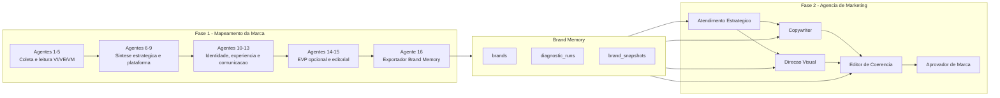
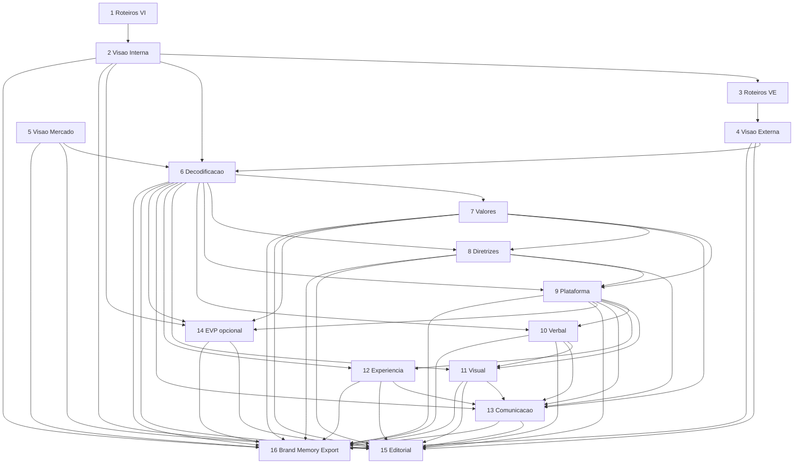
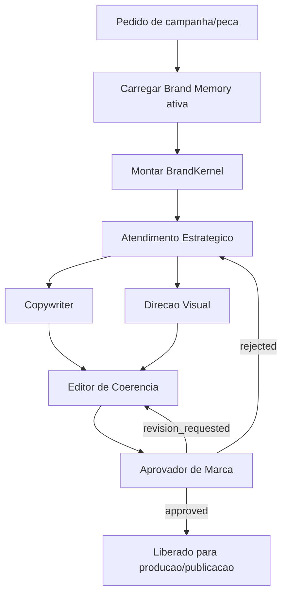

# Estrutura Atual e Fluxo de Agentes

Documento de referencia para evoluir o modelo ideal da Espansione.

Estado atual: a Fase 1 faz o mapeamento da marca, consolida os outputs dos agentes e gera a Brand Memory. A Fase 2 usa essa Brand Memory como insumo para operar uma agencia de marketing enxuta, com papeis especializados e um gate final de aprovacao.

## Visao Geral

## Camadas do Sistema

### Aplicacao Principal

- `web/apps/diagnostic-web`
- Contem o painel, formularios, APIs, execucao da esteira e visualizacao dos outputs.
- Hoje e o centro operacional da Fase 1.

### Tipos Compartilhados

- `web/packages/types`
- Define o contrato `EspansioneDiagnostic`.
- Esse contrato e a ponte formal entre a Fase 1 e a Fase 2.

### Brand Memory

- `web/packages/brand-memory`
- Carrega e reconstrui a memoria ativa da marca.
- Principais funcoes:
  - `loadBrandMemory`
  - `getBrandMemory`
  - `getBrandMemorySlice`

### Agencia

- `web/packages/agents`
- Contem a Fase 2 enxuta.
- Nao chama modelo diretamente.
- Transforma Brand Memory em briefings/prompt packs para agentes especialistas.

### Worker

- `web/apps/agency-worker`
- Placeholder neutralizado.
- Deve nascer apenas quando houver necessidade real de fila, agendamento, execucao longa ou tarefas fora da Vercel.

## Fase 1 - Esteira de Mapeamento da Marca

### Agente 1 - Roteiros VI / Entrevistas Internas

- Stage: `pre_diagnostico`
- Inputs: formularios de socios, colaboradores e posicionamento.
- Funcao: preparar roteiros e leitura inicial para investigacao interna.
- Saida alimenta: Agente 2.

### Agente 2 - Consolidado da Visao Interna

- Stage: `diagnostico_interno`
- Inputs: Agente 1, formularios internos, entrevistas, CIS e diagnostico 360.
- Funcao: consolidar cultura, sociedade, time, maturidade, tensoes internas e evidencias.
- Exporta para Brand Memory: `vi`.
- Saida alimenta: Agentes 3, 6, 14, 15 e 16.

### Agente 3 - Roteiros VE / Entrevistas Cliente

- Stage: `diagnostico_externo`
- Inputs: Agente 2 e intake de clientes.
- Funcao: preparar roteiros e estrutura de escuta externa.
- Saida alimenta: Agente 4.

### Agente 4 - Consolidado da Visao Externa

- Stage: `diagnostico_externo`
- Inputs: Agente 3, intake de clientes e entrevistas com clientes.
- Funcao: consolidar percepcao externa, experiencia atual, marca atual versus ideal, concorrentes percebidos e hipoteses direcionais.
- Exporta para Brand Memory: `ve`.
- Saida alimenta: Agentes 6, 15 e 16.

### Agente 5 - Visao de Mercado

- Stage: `diagnostico_externo`
- Inputs: intake de socios e pesquisa externa.
- Funcao: mapear mercado, concorrentes, territorios, tendencias, oportunidades e ameacas.
- Exporta para Brand Memory: `vm` e `vm_sources`.
- Saida alimenta: Agentes 6, 15 e 16.

### Agente 6 - Decodificacao e Direcionamento Estrategico

- Stage: `sintese`
- Inputs: Agentes 2, 4 e 5.
- Checkpoint: 1.
- Funcao: cruzar VI, VE e VM; identificar convergencias, divergencias, impulsionadores, detratores, aceleradores, de/para e escolhas pendentes.
- Exporta para Brand Memory: `decodificacao`.
- E agente critico para a Fase 2.
- Saida alimenta: Agentes 7, 8, 9, 10, 11, 12, 13, 14, 15 e 16.

### Agente 7 - Valores e Atributos

- Stage: `estrategia`
- Inputs: Agente 6.
- Funcao: definir valores, atributos de personalidade e coerencia diagnostica.
- Exporta para Brand Memory: `values_and_attributes`.
- Saida alimenta: Agentes 8, 9, 13, 14, 15 e 16.

### Agente 8 - Diretrizes Estrategicas

- Stage: `estrategia`
- Inputs: Agentes 6 e 7.
- Funcao: converter diagnostico em diretrizes estrategicas acionaveis.
- Exporta para Brand Memory: `diretrizes_estrategicas` e `diretrizes_reinforcement_logic`.
- Saida alimenta: Agentes 9, 13, 15 e 16.

### Agente 9 - Plataforma de Branding

- Stage: `estrategia`
- Inputs: Agentes 6, 7 e 8.
- Checkpoint: 2.
- Funcao: definir plataforma de marca, proposito, arquetipo, atributos, valores, discurso de posicionamento, tagline e atuacao nas tres ondas.
- Exporta para Brand Memory: `plataforma_branding`.
- E agente critico para a Fase 2.
- Saida alimenta: Agentes 10, 11, 12, 13, 14, 15 e 16.

### Agente 10 - Identidade Verbal

- Stage: `visual_verbal`
- Inputs: Agentes 6 e 9.
- Funcao: definir tons de voz, territorios de palavras, palavras proibidas e convencoes de naming.
- Exporta para Brand Memory: `voice_profile`.
- Saida alimenta: Agentes 11, 13, 15 e 16.

### Agente 11 - One Page de Personalidade Visual

- Stage: `visual_verbal`
- Inputs: Agentes 6, 9 e 10.
- Checkpoint: 3.
- Funcao: definir identidade visual direcional: manter/perder/ganhar, simbolo, cores, tipografia, fotografia, ilustracao, iconografia, comportamento visual e RDPC.
- Exporta para Brand Memory: `visual_identity`.
- Saida alimenta: Agentes 13, 15 e 16.

### Agente 12 - One Page de Experiencia

- Stage: `cx`
- Inputs: Agentes 6 e 9.
- Funcao: definir personas, jornada, brand moments e coerencia nas tres ondas.
- Exporta para Brand Memory: `experiencia`.
- E agente critico para a Fase 2.
- Saida alimenta: Agentes 13, 15 e 16.

### Agente 13 - Plano de Comunicacao

- Stage: `comunicacao`
- Inputs: Agentes 6, 7, 8, 9, 10, 11 e 12.
- Checkpoint: 4.
- Funcao: construir plano de comunicacao, clusters, diferenciais, narrativa, ondas, canais, ativacoes, plano de 12 meses, KPIs e risco principal.
- Exporta para Brand Memory: `plano_comunicacao`.
- E agente critico para a Fase 2.
- Saida alimenta: Agentes 15 e 16.

### Agente 14 - Plataforma de Marca Empregadora / EVP

- Stage: `marca_empregadora`
- Modular: sim.
- Inputs: Agentes 2, 6, 7 e 9.
- Funcao: construir EVP, manifesto interno, pilares, jornada do colaborador e compatibilidade entre posicionamento externo e interno.
- Exporta para Brand Memory: `evp`.
- Opcional: sua ausencia nao bloqueia a Brand Memory.
- Saida alimenta: Agentes 15 e 16 quando contratado/rodado.

### Agente 15 - Consolidador Editorial do Entregavel Final

- Stage: `encerramento`
- Inputs: Agentes 2, 4, 5, 6, 7, 8, 9, 10, 11, 12, 13 e 14.
- Funcao: gerar carta de abertura, sumario executivo e consolidacao editorial do entregavel final.
- Nao e a fonte canonica da Brand Memory.
- Saida alimenta: entregavel final.

### Agente 16 - Exportador para Brand Memory

- Stage: `encerramento`
- Modular: sim.
- Inputs: Agentes 2, 4, 5, 6, 7, 8, 9, 10, 11, 12, 13 e 14.
- Funcao: coletar apenas as tags `<brand_memory_export>` dos agentes upstream, validar e consolidar no contrato `EspansioneDiagnostic`.
- Nao interpreta, nao infere, nao resolve divergencias.
- Saida canonica: `espansione_diagnostic`.
- Carrega a Brand Memory via `loadBrandMemory` apos revisao humana.

## Dependencias da Fase 1

## Brand Memory

### Contrato Canonico

- Tipo: `EspansioneDiagnostic`
- Local: `web/packages/types/src/espansione-diagnostic.types.ts`
- Origem: Agente 16.
- Destino: `loadBrandMemory`.

### Snapshots Ativos

Cada agente contribuinte vira um snapshot ativo por marca:

- 2: `vi`
- 4: `ve`
- 5: `vm` e `vm_sources`
- 6: `decodificacao`
- 7: `values_and_attributes`
- 8: `diretrizes_estrategicas`
- 9: `plataforma_branding`
- 10: `voice_profile`
- 11: `visual_identity`
- 12: `experiencia`
- 13: `plano_comunicacao`
- 14: `evp` opcional

### Agentes Criticos para Operacao

A Fase 2 depende principalmente destes agentes:

- 6: direcao estrategica.
- 9: plataforma de marca.
- 12: personas, jornada e momentos de marca.
- 13: plano de comunicacao.

Sem esses quatro, a agencia nao deve operar como se tivesse memoria suficiente.

## Fase 2 - Agencia de Marketing

A Fase 2 esta implementada como nucleo puro em `@espansione/agents`.

Ela recebe:

- Um `EspansioneDiagnostic` direto, via `buildAgencyRun`.
- Ou uma marca carregada na Brand Memory, via `buildAgencyRunFromBrandMemory`.

Ela devolve:

- Um `BrandKernel`, que e a memoria compacta da marca para operacao.
- Um conjunto de briefings/prompt packs para os agentes.
- Um checklist de aprovacao.

## BrandKernel

O `BrandKernel` e a versao operacional da Brand Memory para a agencia.

### Strategy

Vem principalmente dos agentes 6, 7, 8 e 9.

- Proposito.
- Arquetipo.
- Posicionamento.
- Tagline.
- Diretrizes.
- De/para estrategico.
- Valores.
- Atributos.

### Audience

Vem principalmente dos agentes 12 e 13.

- Personas.
- Clusters de comunicacao.
- Etapas da jornada.
- Brand moments.

### Voice

Vem principalmente do agente 10.

- Tons de voz.
- Territorios de palavras.
- Palavras proibidas.
- Convencoes de naming.

### Visual

Vem principalmente do agente 11.

- Manter.
- Perder.
- Ganhar.
- Cores.
- Tipografia.
- Fotografia.
- Comportamento visual.
- Simbolo/logo.

### Communication

Vem principalmente do agente 13.

- Ondas de branding.
- Canais.
- Diferenciais.
- Ativo proprietario central.
- Principal risco a monitorar.

## Agentes da Fase 2

### Atendimento Estrategico

- ID: `account_director`
- Missao: traduzir Brand Memory em briefing de campanha.
- Consome: agentes 6, 9, 12 e 13.
- Produz:
  - `briefing_operacional`
  - `hipotese_criativa`
  - `criterios_de_sucesso`

Uso ideal:

- Primeiro agente da Fase 2.
- Define objetivo, audiencia, promessa, contexto e criterio de sucesso.
- Evita que copy e visual comecem sem direcao.

### Copywriter

- ID: `copywriter`
- Missao: criar textos no tom proprietario da marca.
- Consome: agentes 9, 10, 12 e 13.
- Produz:
  - `copy_principal`
  - `variacoes`
  - `cta`
  - `racional_de_tom`

Uso ideal:

- Recebe briefing do Atendimento.
- Usa tom de voz, territorios de palavras, palavras proibidas e ondas de comunicacao.
- Nao inventa fatos, claims ou promessas ausentes no briefing.

### Direcao Visual

- ID: `visual_director`
- Missao: traduzir identidade visual em direcao de arte.
- Consome: agentes 9, 11, 12 e 13.
- Produz:
  - `direcao_de_arte`
  - `regras_visuais`
  - `assets_necessarios`

Uso ideal:

- Recebe briefing do Atendimento.
- Define layout, imagem, cor, tipografia, composicao e comportamento da peca.
- Deve respeitar manter/perder/ganhar e evitar caminhos marcados como inadequados.

### Editor de Coerencia

- ID: `editor`
- Missao: ajustar a entrega para consistencia estrategica.
- Consome: agentes 6, 7, 8, 9, 10 e 13.
- Produz:
  - `versao_editada`
  - `ajustes_recomendados`
  - `riscos_de_incoerencia`

Uso ideal:

- Recebe copy e direcao visual.
- Corta excesso, alinha promessa, preserva escolhas estrategicas e aponta riscos.
- Age antes do Aprovador.

### Aprovador de Marca

- ID: `approver`
- Missao: ser a barreira final antes de publicar.
- Consome: todos os slices ativos da Brand Memory.
- Produz:
  - `decisao`
  - `checklist`
  - `ajustes_obrigatorios`

Decisoes esperadas:

- `approved`
- `revision_requested`
- `rejected`

Uso ideal:

- Verifica coerencia estrategica, verbal, visual, audiencia, canal, restricoes e risco.
- Se houver violacao da Brand Memory, pede revisao em vez de aprovar.

## Fluxo Operacional da Fase 2

## Fluxo de Dados da Fase 2

1. Usuario cria um pedido de campanha, peca ou ativo.
2. Sistema busca a Brand Memory ativa da marca.
3. `buildBrandKernel` compacta o diagnostico em uma memoria operacional.
4. `buildAgencyRun` monta os briefings para os agentes.
5. Atendimento Estrategico cria o briefing operacional.
6. Copywriter cria texto e variacoes.
7. Direcao Visual cria direcao de arte.
8. Editor de Coerencia ajusta e reduz riscos.
9. Aprovador de Marca decide se aprova, pede revisao ou rejeita.

## Pontos que Foram Simplificados

O modelo atual evita:

- Worker agentico prematuro.
- Dashboard separado de agencia antes de existir fluxo validado.
- State machine complexa.
- Reprocessamento automatico sem criterio humano.
- Banco relacional detalhado para cada subtarefa criativa antes do produto estar claro.

O modelo atual preserva:

- Brand Memory como fonte canonica.
- Revisao humana antes de carregar memoria.
- Agentes especialistas com responsabilidades claras.
- Aprovador como gate final.
- Possibilidade de crescer para worker/fila depois.

## Proximas Decisoes de Modelo

Ainda precisam ser definidos no modelo ideal:

- Quais tipos de pedido a agencia aceita primeiro.
- Quais entregaveis entram no MVP: post, landing page, email, campanha, roteiro, apresentacao etc.
- Se os agentes da Fase 2 rodam em sequencia fixa ou com orquestrador.
- Onde salvar outputs da Fase 2: tabela nova, `content_examples`, `campaign_briefs` ou estrutura mais simples.
- Como o Aprovador registra decisoes e aprendizados.
- Quando performance real vira aprendizado ativo na Brand Memory.
- Se havera biblioteca de assets visuais ou apenas diretrizes no inicio.

