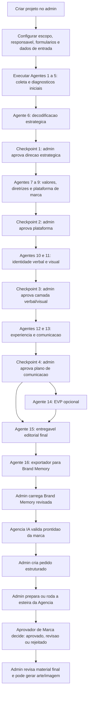

# Fluxo do Administrador da Plataforma

Este documento descreve o fluxo operacional da Espansione do ponto de vista do administrador da plataforma: da criacao do projeto, passando pela esteira de agentes da Fase 1, ate a ativacao da Agencia IA na Fase 2.

O principio central e simples: o admin conduz uma esteira controlada. A IA produz diagnosticos, memoria e entregaveis; o admin aprova checkpoints, revisa outputs criticos e decide quando a marca esta pronta para virar insumo operacional da Agencia.

## Visao Geral

## Tela Principal Do Admin

A pagina principal do projeto no admin e o centro de comando da Fase 1. Ela concentra progresso, execucao dos agentes, outputs, curadoria e entrada para a Agencia.

Elementos principais:

- **Fluxo principal**: card superior fixo com status da esteira, progresso, atalhos dos agentes e botao de acao principal.
- **Botao de acao principal**: muda conforme o estado do projeto. Pode executar o proximo agente, aprovar checkpoint, gerar Brand Memory ou carregar Brand Memory.
- **Preparacao**: atalhos para Curadoria e Agencia IA.
- **Responsavel do Projeto**: dados do responsavel e contato.
- **Clusters de Comunicacao**: selecao dos clusters que alimentam o Agente 13.
- **Escopo do Projeto**: define escolhas como EVP, que afetam a esteira.
- **Esteira de outputs**: lista os relatorios gerados pelos agentes em ordem inversa, com acesso ao documento, PDF, resumo e conteudo completo.
- **Acoes de manutencao**: permitem excluir outputs especificos com cuidado, reabrindo dependencias quando necessario.

O admin nao precisa procurar a proxima etapa manualmente. A plataforma calcula o proximo passo possivel com base em dependencias, checkpoints pendentes e outputs ja gerados.

## Fase 1: Esteira De Agentes

| Agente | Nome | Papel para o admin | Output principal | Trava ou efeito |
| --- | --- | --- | --- | --- |
| 1 | Roteiros VI - Entrevistas Internas | Prepara roteiros para capturar a visao interna. | Roteiros de entrevista interna. | Abre base para consolidar a visao interna. |
| 2 | Consolidado da Visao Interna (VI) | Consolida o que a organizacao diz sobre si mesma. | Diagnostico interno. | Alimenta agentes estrategicos e Brand Memory. |
| 3 | Roteiros VE - Entrevistas Cliente | Prepara roteiros para capturar a visao externa. | Roteiros de entrevista externa. | Abre base para consolidar a visao externa. |
| 4 | Consolidado da Visao Externa (VE) | Consolida percepcao de clientes e mercado proximo. | Diagnostico externo. | Alimenta sintese estrategica e Brand Memory. |
| 5 | Visao de Mercado (VM) | Traz contexto externo e pesquisa de mercado. | Diagnostico de mercado. | Alimenta decodificacao e posicionamento. |
| 6 | Decodificacao e Direcionamento Estrategico | Cria a primeira grande sintese estrategica. | Direcao estrategica e decodificacao. | Gera Checkpoint 1. E slice critico da Agencia. |
| 7 | Valores e Atributos | Organiza principios, atributos e fundamentos. | Valores e atributos da marca. | Alimenta diretrizes, plataforma e memoria. |
| 8 | Diretrizes Estrategicas | Traduz a estrategia em diretrizes de uso. | Diretrizes estrategicas. | Alimenta plataforma e Brand Memory. |
| 9 | Plataforma de Branding | Consolida a plataforma central da marca. | Plataforma de marca. | Gera Checkpoint 2. E slice critico da Agencia. |
| 10 | Identidade Verbal (UVV) | Define voz, tom, linguagem e caminhos verbais. | Identidade verbal. | Alimenta comunicacao, Agencia e copy. |
| 11 | One Page de Personalidade (Visual) | Define direcao visual e personalidade estetica. | One page visual. | Gera Checkpoint 3. Alimenta Agencia visual. |
| 12 | One Page de Experiencia | Mapeia personas, jornada e momentos de marca. | Experiencia e jornada. | E slice critico da Agencia. |
| 13 | Plano de Comunicacao - A Marca Fala | Organiza comunicacao, canais, clusters e mensagens. | Plano de comunicacao. | Gera Checkpoint 4. E slice critico da Agencia. |
| 14 | Plataforma de Marca Empregadora (EVP) | Etapa modular quando o escopo inclui marca empregadora. | Plataforma EVP. | Opcional; entra no entregavel final se ativada. |
| 15 | Consolidador Editorial do Entregavel Final | Junta a narrativa final do diagnostico. | Entregavel editorial final. | Fecha a entrega consultiva da Fase 1. |
| 16 | Exportador para Brand Memory | Consolida exports estruturados em memoria canonica. | `EspansioneDiagnostic` dentro de `<brand_memory_export>`. | Libera carregamento da Brand Memory para a Agencia. |

## Checkpoints Humanos

Os checkpoints existem para impedir que uma decisao estrategica ruim contamine o restante da esteira.

| Checkpoint | Depois do agente | O que o admin aprova | Por que importa |
| --- | --- | --- | --- |
| 1 | Agente 6 | Decodificacao e direcao estrategica. | Tudo que vem depois depende da leitura estrategica inicial. |
| 2 | Agente 9 | Plataforma de marca. | Consolida a base da marca antes de verbal, visual e experiencia. |
| 3 | Agente 11 | Camadas verbal e visual. | Evita que comunicacao avance com linguagem ou visual desalinhados. |
| 4 | Agente 13 | Plano de comunicacao. | Fecha os blocos criticos que a Agencia usa para operar. |

Enquanto houver checkpoint pendente, a plataforma deve bloquear os agentes posteriores. O admin precisa revisar o output, aprovar o checkpoint e so entao seguir.

## Dependencias E Execucao

Cada agente declara quais agentes anteriores precisa receber como insumo. Quando o admin tenta executar um agente:

1. A plataforma verifica se o projeto existe e se o usuario pode operar aquele projeto.
2. A plataforma confere se as dependencias obrigatorias ja foram geradas.
3. A plataforma verifica se existe checkpoint pendente bloqueando a etapa.
4. O contexto e montado com dados do projeto, formularios, CIS quando aplicavel e outputs anteriores.
5. O agente roda pelo gateway de IA da aplicacao principal.
6. O output e salvo na tabela de outputs e aparece na esteira de outputs.
7. Se o agente tiver checkpoint, a plataforma cria a trava de aprovacao.

Do ponto de vista do admin, isso significa que o fluxo deve parecer sequencial, mesmo que por baixo existam varias fontes de contexto.

## Curadoria

A Curadoria e uma area de preparacao e controle. Ela serve para revisar achados, organizar evidencias e apoiar a qualidade dos agentes antes que os outputs avancem na esteira.

Uso esperado pelo admin:

- revisar achados aprovaveis;
- verificar materiais de apoio;
- manter insumos consistentes antes de rodar agentes importantes;
- evitar que o diagnostico final seja construido em cima de evidencias fracas ou incompletas.

A Curadoria nao substitui os checkpoints. Ela prepara a esteira; os checkpoints bloqueiam decisoes estrategicas.

## Brand Memory

A Brand Memory e a ponte formal entre Fase 1 e Fase 2.

Fluxo operacional:

1. Os agentes da Fase 1 emitem blocos estruturados em `<brand_memory_export>`.
2. O Agente 16 coleta somente esses blocos estruturados.
3. O Agente 16 valida, consolida e devolve um `EspansioneDiagnostic`.
4. O admin revisa o output do Agente 16.
5. O admin aciona **Carregar Brand Memory**.
6. A memoria ativa passa a ser a fonte canonica para a Agencia IA.

O Agente 16 nao deve inventar estrategia nova. Ele e um normalizador operacional: coleta, valida e consolida.

## Prontidao Da Marca Para Agencia

A Agencia IA so deve aceitar pedidos quando a Brand Memory tiver os blocos minimos.

Slices criticos:

- `decodificacao`
- `plataforma_branding`
- `experiencia`
- `plano_comunicacao`

Slices complementares importantes:

- `voice_profile`
- `visual_identity`
- `values_and_attributes`
- `diretrizes_estrategicas`

Estados possiveis:

| Status | Condicao | O que o admin pode fazer |
| --- | --- | --- |
| `not_ready` | Sem Brand Memory ou quase nenhum slice critico. | Nao cria pedidos. Deve rodar/revisar Fase 1. |
| `partial_ready` | Alguns slices existem, mas falta pelo menos um critico. | Nao cria pedidos. Deve completar a memoria. |
| `ready_for_content` | Quatro slices criticos existem, mas falta voz ou visual. | Pode criar pecas de conteudo limitadas, com warnings. |
| `ready_for_campaigns` | Quatro slices criticos, voz e visual existem. | Pode criar pedidos completos, incluindo landing page copy. |

Tipos permitidos por prontidao:

- `not_ready`: nenhum.
- `partial_ready`: nenhum.
- `ready_for_content`: post social, carrossel, roteiro curto, e-mail.
- `ready_for_campaigns`: post social, carrossel, roteiro curto, e-mail e copy de landing page.

## Fase 2: Agencia IA

A Agencia IA usa a Brand Memory como fonte canonica. Ela nao deve aprender automaticamente nem alterar a Brand Memory sem revisao humana.

Fluxo do admin:

1. Entrar em **Agencia IA** a partir do projeto.
2. Verificar o status de prontidao da marca.
3. Criar um pedido estruturado se a marca estiver pronta.
4. Abrir o pedido.
5. Preparar briefing ou rodar a esteira da Agencia.
6. Revisar os outputs de cada agente.
7. Conferir a decisao final do Aprovador de Marca.
8. Se fizer sentido, gerar uma arte/imagem a partir da peca aprovada.

Campos do pedido:

- marca;
- tipo de entrega;
- canal;
- objetivo;
- publico ou cluster;
- oferta, produto ou servico;
- contexto;
- CTA desejado;
- restricoes;
- material de referencia.

O campo de publico/cluster deve aproveitar clusters vindos da Brand Memory quando disponiveis. Se nao houver clusters, o admin pode preencher texto livre.

## Agentes Da Agencia

| Ordem | Agente | Missao | Output para o admin |
| --- | --- | --- | --- |
| 1 | `account_director` | Traduz Brand Memory e pedido em briefing operacional. | Briefing, hipotese criativa e criterios de sucesso. |
| 2 | `copywriter` | Cria texto no tom proprietario da marca. | Copy principal, variacoes, CTA e racional de tom. |
| 3 | `visual_director` | Traduz identidade visual em direcao de arte. | Direcao de arte, regras visuais e assets necessarios. |
| 4 | `editor` | Ajusta consistencia estrategica e corta excessos. | Versao editada, riscos e score de aderencia. |
| 5 | `approver` | Atua como gate final antes de publicacao. | Decisao, checklist e ajustes obrigatorios. |

Decisoes do aprovador:

- `approved`: a peca pode seguir para revisao humana final e producao.
- `revision_requested`: existe material aproveitavel, mas ajustes sao obrigatorios.
- `rejected`: a peca nao deve seguir nesse formato.

Mesmo quando a IA aprova, a publicacao continua sendo decisao humana. Nao existe publicacao automatica neste fluxo.

## Material Aprovado E Imagem

Quando a esteira da Agencia gera material aprovado ou revisavel, o admin deve olhar primeiro para a entrega consolidada na pagina do pedido.

Depois disso, pode usar a acao de gerar imagem da arte aprovada. O fluxo esperado e:

1. A Agencia gera copy, direcao visual e aprovacao.
2. O admin revisa o material.
3. O admin clica para gerar imagem.
4. A plataforma chama o modelo de imagem configurado.
5. A imagem aparece na galeria da pagina.
6. O admin pode gerar outra opcao e comparar as variacoes.
7. O admin escolhe ou baixa a alternativa preferida.

Observacao operacional: a geracao de imagem pode incluir texto dentro da arte, mas texto em imagem ainda precisa de revisao humana. Se houver erro ortografico, distorcao ou palavra inventada, o admin deve gerar outra opcao ou ajustar o prompt/arte antes de usar.

## Persistencia Do Fluxo

Principais registros envolvidos:

- `outputs`: relatorios dos agentes da Fase 1.
- checkpoints da esteira: travas humanas entre blocos estrategicos.
- logs de execucao: rastreio de chamadas, erros e tentativas.
- Brand Memory ativa: memoria consolidada depois do Agente 16 e carregamento humano.
- `agency_requests`: pedidos estruturados da Agencia.
- `agency_runs`: execucoes da esteira da Agencia para um pedido.
- `agency_steps`: passos individuais da Agencia, incluindo input, output, status, erro e metadados.

A Fase 2 deve depender da Brand Memory, nao dos outputs soltos da Fase 1. Os outputs soltos continuam importantes para auditoria, revisao e recuperacao.

## Erros E Recuperacao

Situacoes comuns para o admin:

- **Agente bloqueado por dependencia**: rodar primeiro os agentes obrigatorios anteriores.
- **Checkpoint pendente**: revisar output e aprovar checkpoint antes de seguir.
- **Agente 16 sem export valido**: regerar o Agente 16 depois de garantir que os agentes upstream emitiram `<brand_memory_export>`.
- **Brand Memory invalida**: revisar JSON do export e carregar novamente.
- **Agencia `not_ready`**: completar os quatro slices criticos da Brand Memory.
- **Tabela da Agencia ausente**: aplicar migrations de `agency_requests`, `agency_runs` e `agency_steps` no banco do ambiente.
- **Output ruim da Agencia**: pedir revisao, ajustar pedido ou rodar novamente a esteira.
- **Imagem com texto errado**: gerar nova opcao ou separar revisao visual de arte final.
- **Exclusao de output antigo**: usar a analise em cascata, pois outputs posteriores podem depender dele.

## O Que Esta Fora Do Fluxo Atual

Nao fazem parte do fluxo inicial:

- worker dedicado da Agencia;
- calendario editorial completo;
- publicacao automatica em redes sociais;
- integracoes com midia paga ou CRM;
- aprendizado automatico direto na Brand Memory;
- orquestrador agentico autonomo;
- dashboard avancado de performance;
- geracao final de campanha multicanal sem revisao humana.

## Checklist Do Admin

Antes de abrir a Agencia:

- projeto criado e escopo conferido;
- formularios, entrevistas e insumos principais carregados;
- agentes 1 a 13 executados conforme escopo;
- checkpoints 1 a 4 aprovados;
- Agente 14 executado se EVP fizer parte do projeto;
- Agente 15 gerado para o entregavel final;
- Agente 16 gerado com `<brand_memory_export>` valido;
- Brand Memory carregada;
- prontidao da Agencia em `ready_for_content` ou `ready_for_campaigns`.

Antes de publicar ou usar uma peca:

- pedido estruturado revisado;
- esteira da Agencia executada;
- decisao do Aprovador conferida;
- warnings e ajustes obrigatorios tratados;
- material final validado por humano;
- imagem revisada visualmente, incluindo texto, ortografia, marca e claims.

